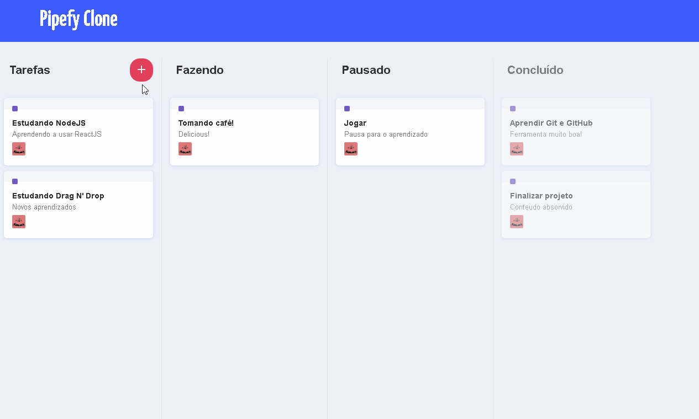

<h1 align="center">Pipefy Clone - ReactJS<h1>
<p align="center">


</p>

<p align="center>

</p>

## :computer: WebView

<h4 align="center">
    Tentativa de recriação da interface do Pipefy com objeto de entender o conceito de Drag N' Drop.
</h4>

<br>

<p align="center">
    
</p>


## 🚀 Tecnologias

- [ReactJS]

## ❓ Como utilizar?

### Instalação

```bash
$ cd pipefy-clone
$ yarn
$ yarn start
```

<br>

## 🎓 Quem ensinou?

- As aulas foram ministradas por [Diego Fernandes](https://www.youtube.com/watch?v=awRtgpRsdTQ) em videos no youtube.

<br>

Criado com :coffee: por Jhonatan Cunha.
